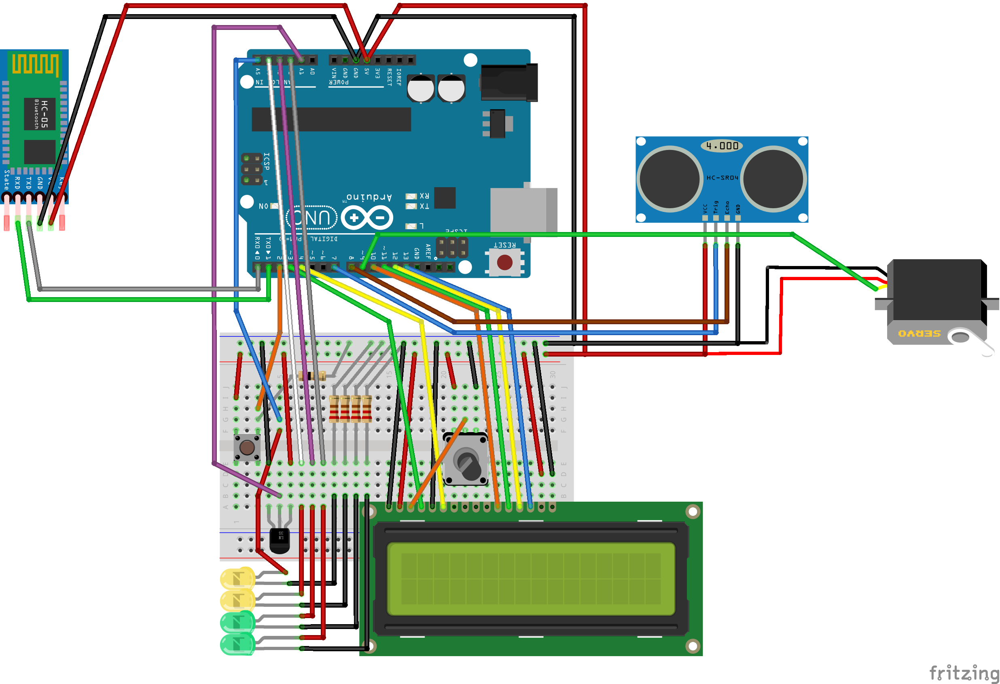
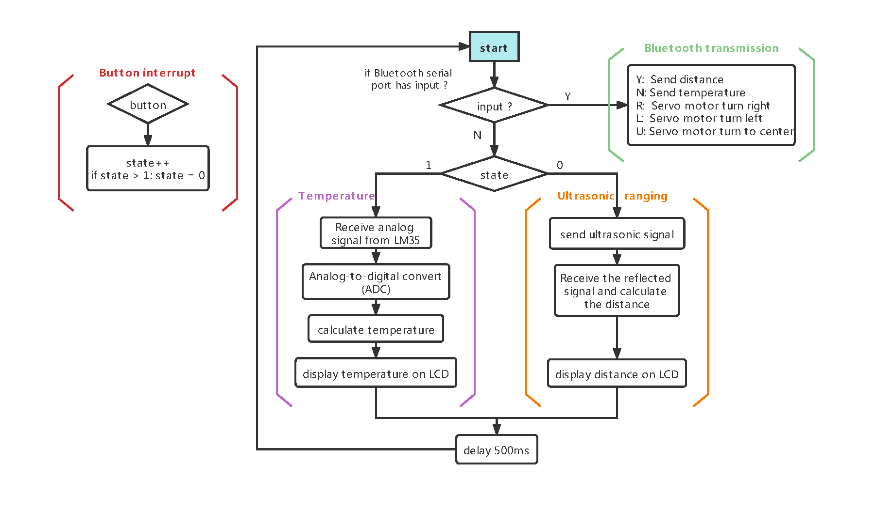

# Arduino_minProject

Microchip Studio (ATmega 328p)

demo: https://www.bilibili.com/video/BV1Jq4y1q7V8

Components:

- ATmega 328p micrcontroller (Arduino Uno)
- ultrasonic sensor (HCSR04)
- LM35
- LCD 1602A
- 4 LEDs
- button
- Servo motor
- hc05 zs-040

schematics diagram

